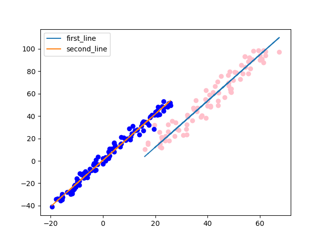
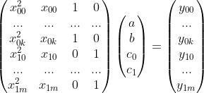
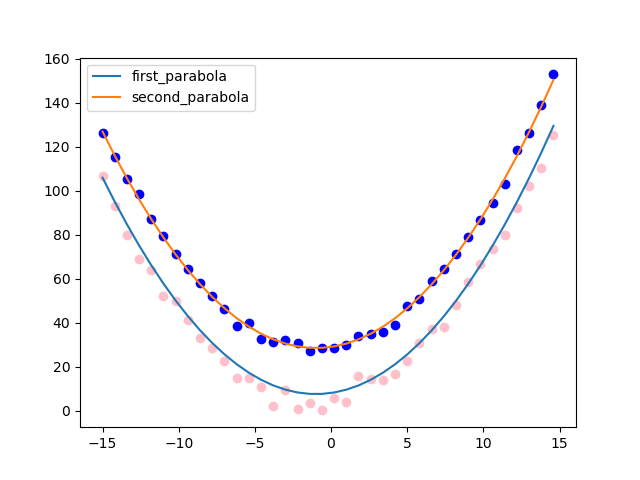

# 📝 simple parallel line fitting using RANSAC Linear Least Squares approximation
***

- fitting of 2 parallel lines: see details about the formulation in reference [2]

<p align="center">
  
</p>

- fitting of 2 parallel parabolas: not the official text-book definition, but here 2 parallel parabolas p<sub>0</sub>, p<sub>1</sub> are defined by: ax<sup>2</sup>+bx+c<sub>0</sub> (p<sub>0</sub>); ax<sup>2</sup>+bx+c<sub>1</sub> (p<sub>1</sub>). Then the parallel parabola fitting can be formulated by the following least squares problem:

<p align="center">
  
</p>

<p align="center">
  
</p>

## :tada: TODO
***

- [x] fitting of two parallel lines, demo code
- [x] fitting of two parallel parabola, demo code
- [ ] add julia code (just to practice julia)

## 🎛  Dependencies
***
```bash
    python -m pip install -r requirements.txt
```

## :running: How to Run ##
***

- demo for fitting of two parallel lines
```
    python demo_parallel_line_fitting.py
```

- demo for fitting of two parabolas
```
    python demo_parallel_parabola_fitting.py
```

## :gem: References ##
***

- [1] [basic theory about least-squares data fitting](https://courses.grainger.illinois.edu/cs357/sp2021/notes/ref-17-least-squares.html)
- [2] [basic theory about parallel line fitting](http://people.inf.ethz.ch/arbenz/MatlabKurs/node86.html)
- [3] [a detailed blog about RANSAC 3D line fitting without SVD-based least squares method](https://zalo.github.io/blog/line-fitting/)
